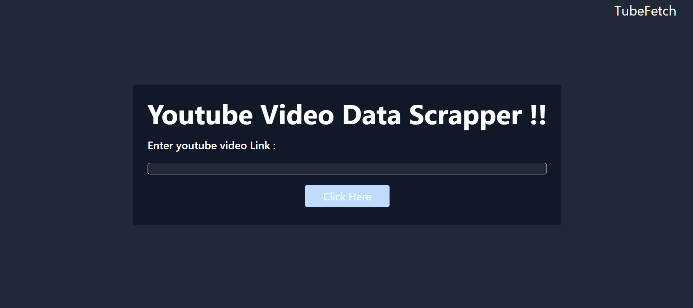

># TubeFetch
>[tubefetch.up.railway.app](https://tubefetch.up.railway.app/)  

Efficiently extract video data, comments, and metadata from YouTube for analysis and insights. Ideal for content creators, marketers, and researchers seeking to leverage YouTube's vast data.

# 📷 Project SnapShots

---




# 🔧 Project Setup 

---

Step 1 
: Open your System/IDE terminal.  

Step 2 
: Clone the repository using command ```git clone https://github.com/Krushnabajaj/TubeFetch.git```  

Step 3 
: Open the Project and go to location "```TubeFetch\src\main\java\com\example\TubeFetch\TubeFetchApplication.java```".  

Step 4 
: Run the project using option "``` Run TubeFetchApplication from main()```".  

step 5 
: After successful project run go to the browser and search localHost:8080 .  

# 🙌 Contribute  

---
You might encounter some bugs while using this app. You are more than welcome to contribute. Just submit changes via pull request and I will review them before merging. Make sure you follow community guidelines.  

# ⭐ Give A Star

---

You can also give this repository a star to show more people and they can use this repository.

# ☕ Buy Me a Coffee

---
[Buy Me a Coffee](https://buymeacoffee.com/krushna)

